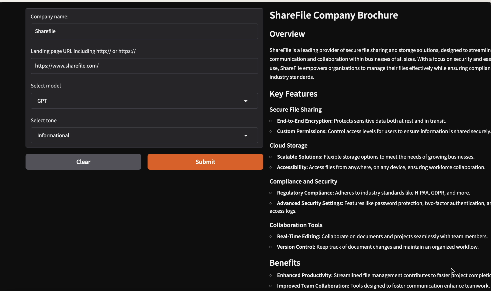

# AI Company Brochure Generator 🚀

An intelligent web application that analyzes company landing pages and automatically generates customized brochures using various AI models (GPT, Claude, and Gemini). The tool helps create informative content for prospective customers, investors, and recruits. The company brochure can be futher enhanced to write marketing content, generate a product tutorial from a spec, create personalized email content, and so much more.

## Business Application

This can be applied to any business - summarizing the news, summarizing financial performance, summarizing lengthy agreements - the applications are limitless.

## 🎯 Features

- Landing page analysis and content extraction supporting different models (GPT, Claude, Gemini)
- Customizable response tones (Informational, Promotional, Humorous)
- Real-time streaming of generated content
- User-friendly Gradio interface


<p align="left">
  
</p>

## 🛠 Technical Environment

### Prerequisites

- Python 3.11 or higher
- Anaconda or Virtual Environment
- API Keys:
  - OpenAI API key
  - Anthropic API key
  - Google API key

### Installation

1. Clone the repository:
    ```bash
    git clone https://github.com/moniydv/ai_summarizer.git
    cd ai_summarizer
    ```

2. Create and activate the Conda environment:
    ```bash
    conda env create -f environment.yml
    conda activate ai_summarizer
    ```

3. Configure API keys:
   Create a `.env` file in the project root and add your API keys:
    ```env
    OPENAI_API_KEY=your_openai_key_here
    ANTHROPIC_API_KEY=your_anthropic_key_here
    GOOGLE_API_KEY=your_google_key_here
    ```

## 🚀 Usage

1. Start the application:
    ```bash
    python app.py
    ```

2. Access the web interface through your browser (typically at `http://localhost:7860`)

3. Enter the required information:
   - Company name
   - Landing page URL (including http:// or https://)
   - Select the AI model (GPT, Claude, or Gemini)
   - Choose the desired tone (Informational, Promotional, or Humorous)

4. Click "Submit" to generate the brochure

## 📚 Project Structure

```
ai_summarizer/
├── assets/            # Media files directory
│   └── demo.gif       # Application demo
├── app.py            # Main application file
├── environment.yml   # Conda environment specification
├── requirements.txt  # Python dependencies
├── .env             # API keys and configuration
└── README.md        # Project documentation
```

## 🔑 Dependencies

- gradio
- openai
- anthropic
- google-generativeai
- python-dotenv
- requests
- beautifulsoup4

## ⚠️ Important Notes

- Ensure all API keys are properly configured before running the application
- The application requires a stable internet connection to access the AI models and analyze websites
- Some websites may block web scraping attempts; ensure you have permission to analyze the target websites

## 🤝 Contributing

1. Fork the repository
2. Create your feature branch (`git checkout -b feature/AmazingFeature`)
3. Commit your changes (`git commit -m 'Add some AmazingFeature'`)
4. Push to the branch (`git push origin feature/AmazingFeature`)
5. Open a Pull Request

## 👥 Author

[Monika Yadav] - Initial work - [moniydv](https://github.com/moniydv)

## 🙏 Acknowledgments